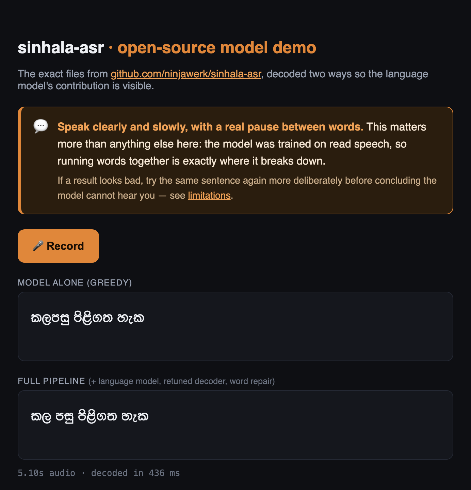

# sinhala-asr

Offline Sinhala speech recognition. A 300M-parameter model small enough to run
on a phone — it transcribes 16 kHz Sinhala speech several times faster than
real time, with no network involved.

**What is in this repository:** the model, a Python reference implementation
and a local web demo. The Android keyboard some of the figures below were
measured on is a separate project and is *not* included here.

## Quick start

### Prerequisites

- **Python 3.9–3.12.** Not 3.13 or newer — the `kenlm` package has no wheel
  and does not build there yet. `run.sh` looks for a supported interpreter and
  stops with instructions if it cannot find one.
- **ffmpeg**, for decoding recorded audio.
- **~470 MB of disk** for the weights and language model, downloaded on first
  run from the [release page](../../releases) — too large to keep in git.

```bash
# macOS
brew install python@3.12 ffmpeg
# Debian / Ubuntu
sudo apt install python3.12 python3.12-venv ffmpeg
```

### Run it

```bash
git clone https://github.com/ninjawerk/sinhala-asr
cd sinhala-asr
./run.sh          # then open http://localhost:7861
```

Press record, speak Sinhala, and see the result. On first run the script
downloads the model and language model and installs the Python dependencies
into a local `.venv/`; later runs skip all that and start immediately.

<details>
<summary>Manual setup, if you'd rather not run a script</summary>

Same prerequisites as above — in particular a Python 3.9–3.12 interpreter,
since `pip install kenlm` will fail on 3.13+. From the
[release page](../../releases), download `weights.bin` (put it in `model/`,
next to `sinhala_asr_int8.onnx`) plus the language model, then install and run:

```bash
python3.12 -m venv .venv && source .venv/bin/activate
mkdir -p lm
gunzip -c sinhala.arpa.gz  > lm/sinhala.arpa
gunzip -c unigrams.txt.gz > lm/unigrams.txt
pip install -r requirements.txt
python demo.py
```
</details>

## Using it in your own code

The full pipeline — model, language model, word repair:

```python
import json
import numpy as np
import onnxruntime as ort
import soundfile as sf
import kenlm
from pyctcdecode import build_ctcdecoder
from unfuse import WordRepair

vocab = json.load(open("model/vocab.json", encoding="utf-8"))
sess = ort.InferenceSession("model/sinhala_asr_int8.onnx")

audio, sr = sf.read("clip.wav", dtype="float32")   # 16 kHz mono
assert sr == 16000
audio = (audio - audio.mean()) / (audio.std() + 1e-7)   # required
logp = sess.run(None, {"audio": audio[None, :]})[0][0]

labels = [""] + vocab[1:]
charset = set(labels)
words = [w.strip() for w in open("lm/unigrams.txt", encoding="utf-8") if w.strip()]
words = [w for w in words if all(c in charset for c in w)]
decoder = build_ctcdecoder(labels, "lm/sinhala.arpa", words, alpha=0.8, beta=3.0)
text = decoder.decode(logp.astype(np.float32), beam_width=128)

repair = WordRepair(set(words), kenlm.Model("lm/sinhala.arpa"))
print(repair.fix(text))
```

If you only want the raw model — for example to plug in your own decoder —
greedy decoding is just: collapse repeated symbols, drop index 0 (the blank),
join what's left. Expect much rougher output; the language model is where a
third of the accuracy comes from.

## How it works

- The **encoder** is Meta's open
  [omniASR-W2V-300M](https://huggingface.co/facebook/omniASR-W2V-300M),
  used unchanged. It turns audio into rich sound features.
- On top sits a small **Sinhala output layer**, trained on ~185k clips of
  transcribed Sinhala speech ([OpenSLR SLR52](https://openslr.org/52/)).
  This is the only part that was trained.
- Both are fused into one ONNX graph and quantised to **int8** — about a third
  of the original size, with output verified character-for-character
  identical to full precision.

The model outputs, 50 times per second of audio, a probability for each of
105 symbols — Sinhala, plus a handful of Latin letters and digits that occur
in the training transcripts (loanwords, brand names). Turning those into
text is the decoder's job — the simple greedy loop above, or a smarter
decoder with a language model.

## Files

| file | size | where |
|---|---|---|
| `model/sinhala_asr_int8.onnx` | 0.8 MB | this repo |
| `model/vocab.json` | 1 KB | this repo |
| `model/weights.bin` | 342 MB | [release](../../releases) |
| `lm/sinhala.arpa` | 120 MB gzipped | [release](../../releases) — word-level language model |
| `lm/unigrams.txt` | 2.5 MB gzipped | [release](../../releases) — 400k-word list |

## Accuracy

Measured on speakers **and** sentences the model never saw in training.
(Many published Sinhala numbers use test sentences that also appear in the
training data, which makes them look better than they are.)

| decoding | word error rate |
|---|---|
| greedy (model alone) | ~45% |
| + language model beam search | ~32% |

The decoder settings that work best on real dictation are
`alpha=0.8, beta=3.0` — see `demo.py`. For scale: stock Whisper-small scores
390% on the same audio, and the unmodified base model 102.6% — it writes
Sinhala in Bengali script, which is the problem this model exists to fix.

## Demo

`demo.py` is a small local web page: press record, speak Sinhala, and see the
same recording decoded two ways — the model alone, and the full pipeline with
the language model and word repair.



It will not start without the `lm/` files from Quick start: the model alone
is deliberately rough, and a demo of it would give the wrong impression of
what this project does.

`unfuse.py` is the word-repair step. Spoken Sinhala runs words together, and
the decoder sometimes writes several words as one long non-word. This pass
checks whether such a word splits cleanly into real words, and fixes it when
it does.

The language model was built from public Sinhala web text (news, blogs,
subtitles) plus the SLR52 transcripts. It contains word statistics, not the
original documents.

## Keeping memory low

There are two builds of this and they do not use the same amount of memory.
Read the numbers as two separate systems, not as one ladder:

| Build | Memory | Measured with |
|---|---|---|
| Android keyboard (*separate project, not in this repo*) | **227 MB** proportional, 323 MB resident | `dumpsys meminfo`, Galaxy S24 Ultra |
| **Desktop Python** (`demo.py`, this repo) | ~651 MB session, ~780 MB while transcribing | `ps -o rss=`, M1 Max |

Proportional set size is below resident because memory-mapped pages shared
with the page cache are attributed proportionally — the fairer figure for a
model that is mapped rather than loaded.

The desktop number is much the larger, and that is not a failed attempt at the
phone number. It is a different stack: a Python interpreter, numpy and
pyctcdecode all resident, and a 171 MB text ARPA parsed into a 93 MB trie
instead of a 71 MB memory-mapped binary. The desktop build was never trying to
be small; it exists to check the model.

Loaded with no care at all, the desktop build takes **964 MB**. Sections 1–5
are how that comes down to 651, each with the measurement that justifies it.
Section 6 is why the phone build then lands lower still.

### Disk size is a bad proxy for memory

The first thing to unlearn. Measured resident memory against file size:

| Component | On disk | In RAM | Ratio |
|---|---|---|---|
| acoustic model, int8 | 359 MB | **965 MB** | 2.7× |
| language model, ARPA | 171 MB | **93 MB** | 0.5× |

Both surprises point the opposite way from intuition. The language model —
the obvious thing to compress — is *smaller* in memory than on disk, because
kenlm's trie is a tighter representation than the ARPA text it was built
from. Effort was about to go into shrinking the wrong component. Meanwhile
the acoustic model nearly triples: the weights genuinely are int8 on disk
(real `MatMulInteger` ops), and the runtime makes its own copies.

### 1. Map the weights instead of loading them

Export the model as a small graph plus a separate `weights.bin`, and let
onnxruntime find the file next to the graph rather than reading it yourself:

| | at load | after transcribing |
|---|---|---|
| single-file `.onnx` | 558 MB | 904 MB |
| **external `weights.bin`** | **64 MB** | 796 MB |

Load-time memory drops 8.7×, and the output is bit-identical (sha256 over 20
clips matched).

The subtler benefit matters more on a phone than the number does. Mapped
weights are **file-backed clean pages**: under pressure the kernel can drop
them and re-read from storage later. Anonymous heap memory cannot be dropped,
so the kernel kills the process instead. That is the difference between an app
that gives back pages and carries on, and one that dies on every task switch.
It is also why the proportional figure is well below the resident one — those
mapped pages are shared with the page cache.

### 2. Turn off the memory arena

By default onnxruntime grabs memory greedily and does not give it back.

### 3. Turn off weight pre-packing

Pre-packing rearranges int8 weights into a blocked layout for faster matmul,
and keeps a second copy to do it. Turning it off trades a little speed for a
seventh of the footprint:

| Configuration | RAM |
|---|---|
| default | 964 MB |
| memory arena disabled | 760 MB |
| **+ pre-packing disabled** | **651 MB** |

Both settings together:

```python
opts = ort.SessionOptions()
opts.enable_cpu_mem_arena = False
opts.add_session_config_entry("session.disable_prepacking", "1")
opts.intra_op_num_threads = 4
sess = ort.InferenceSession("model/sinhala_asr_int8.onnx", opts)
```

### 4. Cut long recordings into windows

Memory otherwise grows with audio length, without limit:

| 60-second utterance | RAM |
|---|---|
| decoded in one pass | 3,875 MB |
| **overlapping windows** | **780 MB** |

Transcribe overlapping windows of a few seconds, drop the frames near the
seams, and normalise over the whole recording rather than per window.
Footprint then depends on the window size, not on how long someone talks.

### 5. Store the side data so it can be mapped too

The same logic as the weights, applied to everything else the decoder needs.
Convert the language model to kenlm's binary format — the text ARPA is parsed
into memory, the binary is mapped:

```bash
build_binary trie lm/sinhala.arpa lm/sinhala.klm
```

In the Android build — again, a separate project — the lexicon gets the same
treatment. A pointer-chasing trie has to
live on the Java heap, where it cannot be evicted and has to be
garbage-collected; the same information stored as a **sorted array of 64-bit
hashes** is memory-mapped instead, searched by binary search, and allocates
nothing per lookup. 808,377 word prefixes cost 6.2 MB that way.

Choosing the smaller language model helped as much as any code change: a
trigram cost 112 MB of resident memory over the bigram, and on-device counters
showed trigrams were 47% of the file and about 2% of successful lookups. It
was also *less* accurate here — too sparse at this corpus size to be
reliable — so the bigram won twice.

### 6. Why a phone build lands under 500 MB

None of the sections above get the desktop build below about 651 MB, so it
would be reasonable to read this page and conclude 500 MB is out of reach. It
isn't. The Android keyboard built on this model — not part of this repository —
sits at 323 MB resident, and it gets there by being a different program rather
than a better-tuned one:

| | Desktop Python (this repo) | Android (elsewhere) |
|---|---|---|
| runtime | CPython, numpy, pyctcdecode resident | Kotlin, no interpreter |
| language model | 171 MB ARPA → 93 MB in-memory trie | 71 MB binary, memory-mapped |
| lexicon | 400k-word Python list | 6.2 MB + 3.0 MB mapped hash arrays |
| weights | 358 MB, mapped | 342 MB, mapped |
| **resident** | **~780 MB** | **323 MB** |

The weights are the same size in both and are mapped in both — so they are not
what separates the two. The difference is everything *around* the model: no
interpreter, and every auxiliary structure in a form the kernel can page
instead of a form the heap has to hold.

Note also that 323 MB resident is *less* than the 423 MB of files the app maps.
That is the mapping working as intended: pages count as resident only once
touched, and the kernel drops them again under pressure.

### A caveat on the numbers

The laptop figures above are resident set size via `ps -o rss=`; the phone
figures are `dumpsys meminfo`. Different tools measuring different things —
compare each against itself, not across the two. Getting this wrong is easy:
`dumpsys` reports kilobytes, and reading its PSS line as megabytes is how this
README previously claimed a footprint it had never measured.

None of these steps change the output by a single character. Don't take that
on trust — diff the transcripts before and after, which is how everything in
this README was checked.

## Limitations

- Trained on **read speech** — people reading sentences aloud. Natural, fast,
  colloquial speech is harder for it.
- **Word boundaries are the weak spot.** Spoken Sinhala barely marks them
  acoustically — words flow into each other with no pause — and the model
  transcribes sound, so what was spoken as one stream comes out as one long
  welded word. The word-repair pass (`unfuse.py`) splits the clear cases
  afterwards, but it can't catch everything; speaking with slight pauses
  between words avoids the problem at the source.
- No punctuation. Latin letters and digits are in the vocabulary (they appear
  in the training transcripts), but the model emits them too rarely to rely on.
- Wants clean 16 kHz mono audio, close to the microphone.
- Its remaining mistakes are mostly real Sinhala words in the wrong place — a
  language model helps with that; a dictionary alone cannot.

## License and attribution

[Apache 2.0](LICENSE). Free for any use, including commercial.

One thing the license asks of you: if you ship this model in a product, keep
the [NOTICE](NOTICE) file's contents with it (Apache 2.0, section 4d). In
practice that means a line crediting this project somewhere in your app or
its documentation:

> Sinhala speech recognition: sinhala-asr by Deshan Alahakoon
> — github.com/ninjawerk/sinhala-asr

This project itself builds on:

- Base encoder: [facebook/omniASR-W2V-300M](https://huggingface.co/facebook/omniASR-W2V-300M), Apache-2.0, © Meta AI.
- Training data: [OpenSLR SLR52](https://openslr.org/52/), © Google, CC BY-SA 4.0.
